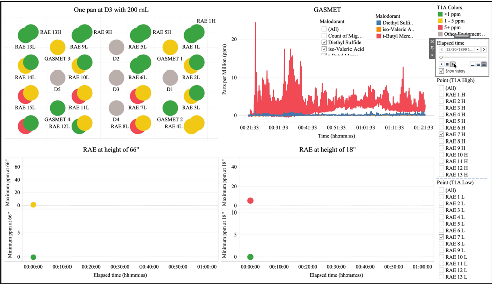

# Tableau Interactive Dashboard  

## Introduction  
Dugway Proving Ground has recently conducted a test that will measure concentrations of chemicals within a closed environment.  In the past, when we have conducted tests like this, we have produced hundreds of plots to show the changes in concentration versus time for the entire experiment.  This type of data visualization is not only time consuming, but inefficient and ineffective.  In order to really understand a concentration versus time experiment, one needs to use an interactive visualization dashboard.  This kind of visualization will allow the user to drive the data story and customize their experience to answer many different questions both quickly and effectively.  Building a visualization like this with the Tableau software is the main focus of this project.  

## Data Sources Used  
Because this visualization was built with actual test data, the data sources will not be provided.  

## Technologies Used  
* Tableau 2020.2  

## Required Packages
Tableau  

## Analysis Methods Used  
* Tableau  
* Tableau Server  
* Interactive Visualizations  

## Visualization Deployment  
Since I am the only one at my work that has a copy of the Tableau software, I had to find a way to share this visualization with the testing community and scientists that wanted access to the data.  The U.S. Army has a Tableau Server9 installed in Washington D.C. for use throughout the Department of Defense (DoD).  I reached out to them to obtain access to this server site so that I could post this visualization.  I was granted access and established a folder specific to my organization.  One key element to this Tableau Server site is that it requires a secure login that is only available with a DoD issued Common Access Card (CAC).  This security feature allows me to control who has access to our organizational folder and who has access to post material to it.  It also helps ensure that our data is kept secure and only available to those with a need to know.  

## Summary of Results  
The image below shows the final layout of the visualization with each of the finished visualizations.  

